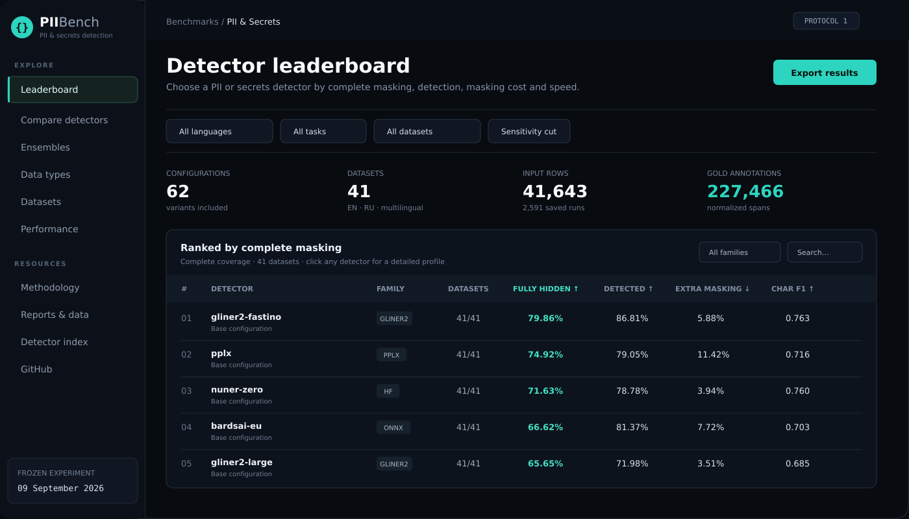
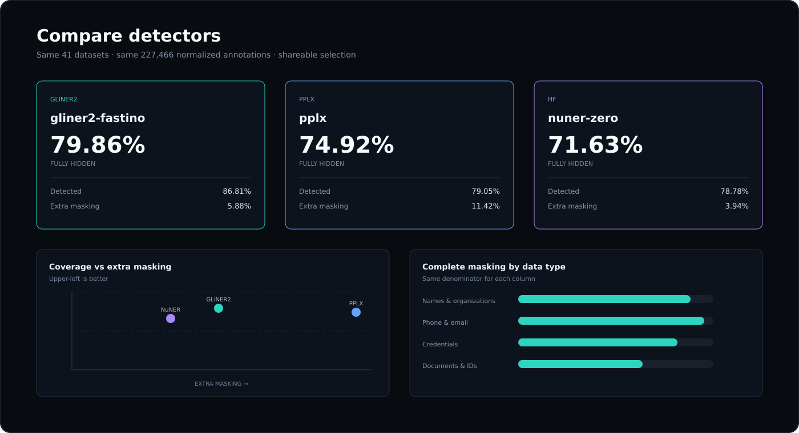

# PII & Secrets Detection Benchmark

**An independent, reproducible benchmark for choosing PII and secret detection tools.**

[](https://pii-secrets-benchmark.vercel.app/leaderboard)
[](docs/methodology.md)
[](docs/reproduce.md)
[](docs/datasets.md)

[](LICENSE)




Find the right detector for **PII**, **secrets**, **English**, **Russian** or **multilingual** text. The leaderboard ranks complete masking first, then exposes detection, extra masking and measured speed as separate decision dimensions.

| Snapshot | Value |
|---|---:|
| Datasets | **41** |
| Input rows | **41,643** |
| Normalized gold annotations | **227,466** |
| Saved prediction runs | **2,591** |
| Frozen experiment | **2026-09-09** |

<!-- BEGIN SNAPSHOT -->
The frozen experiment contains **41 datasets**, **41,643 rows**, **227,466 normalized gold spans** and **2,591 saved prediction runs**. The catalog has 62 execution records, including label variants, mirrors, scanners and rules.
<!-- END SNAPSHOT -->

**Scope:** This is a descriptive comparison under one declared masking protocol, not a production-safety certification.

## Top complete-coverage detectors

All rows below cover the same 41 retained datasets. **Fully Hidden** is the primary metric: every character of the normalized gold annotation must be covered after word-boundary expansion.

| Detector | Fully Hidden ↑ | Detected / Overlapped ↑ | Extra Masking ↓ |
|---|---:|---:|---:|
| `gliner2-fastino` | **79.86%** | 86.81% | 5.88% |
| `pplx` | **74.92%** | 79.05% | 11.42% |
| `nuner-zero` | **71.63%** | 78.78% | 3.94% |
| `bardsai-eu` | **66.62%** | 81.37% | 7.72% |
| `gliner2-large` | **65.65%** | 71.98% | 3.51% |

[Open the live leaderboard](https://pii-secrets-benchmark.vercel.app/leaderboard) to change the language/task slice, include partial coverage, sort every metric, open detector profiles and share the exact filtered URL.

## Compare trade-offs, not one marketing score



The comparison view uses the shared eligible dataset intersection for every selected detector. It exposes complete masking, any-overlap detection, extra masking, character F1, per-type outcomes and measured throughput without collapsing them into an arbitrary composite score.

## Find your result

| Your question | Start here |
|---|---|
| Which detector should I choose? | [Live leaderboard](https://pii-secrets-benchmark.vercel.app/leaderboard) · [Detector profiles](https://pii-secrets-benchmark.vercel.app/detectors) |
| How does every detector score, and what does it cost? | [Every detector](#every-detector-on-the-same-denominator) · [Full configuration list](results/detectors.md) |
| How fast is it on my hardware? | [Performance explorer](https://pii-secrets-benchmark.vercel.app/performance) · [CPU results](#cpu-cost-of-one-pass) · [GPU results](#gpu-cost-of-one-pass) · [All measurement conditions](results/speed.md) |
| How do individual detectors compare? | [Interactive compare](https://pii-secrets-benchmark.vercel.app/compare) · [Models by language and task](results/by-language.md) · [Detector catalog](docs/models.md) |
| What happens to names, passwords, IDs and other types? | [Data-type explorer](https://pii-secrets-benchmark.vercel.app/entities) · [Exact type outcomes](results/by-entity.md) |
| Where are the weak datasets? | [Dataset explorer](https://pii-secrets-benchmark.vercel.app/datasets) · [Dataset report](results/by-dataset.md) · [Dataset catalog](docs/datasets.md) |
| What is the quality / masking / speed trade-off? | [Performance explorer](https://pii-secrets-benchmark.vercel.app/performance) · [Masking outcomes](results/overview.md) · [Ensembles](results/ensemble.md) |
| Where are the machine-readable results? | [Summary CSV](results/summary.csv) · [Category CSV](results/category-metrics.csv) · [Metric definitions](docs/metrics.md) |
| How do I score my own detector? | [Evaluate your detector](#evaluate-your-own-detector) - one command, expected output included |

## Every detector on the same denominator

Thirty-one configurations completed all 41 datasets, so they share one denominator of 227,466 normalized gold spans. Lower is better in the untouched and extra-masking columns; higher is better in the other two. The four highlighted rows are the members of the reference composition used later on this page.


<!-- BEGIN DETECTOR TABLE -->
| Detector | Family | Eligible sets | Untouched / gold | Untouched | Fully hidden | Masked outside annotations | Char F1 | CPU s/10k | GPU s/10k |
|---|---|---:|---:|---:|---:|---:|---:|---:|---:|
| gliner2-fastino | gliner2 | 41/41 | 30,011 / 227,466 | 13.19% | 79.86% | 5.88% | 0.763 | 14.93 | 0.27 |
| bardsai-eu | onnx | 41/41 | 42,383 / 227,466 | 18.63% | 66.62% | 7.72% | 0.703 | - | - |
| pplx | pplx | 41/41 | 47,647 / 227,466 | 20.95% | 74.92% | 11.42% | 0.716 | 9.94 | 2.20 |
| nuner-zero | gliner | 41/41 | 48,263 / 227,466 | 21.22% | 71.63% | 3.94% | 0.760 | 20.12 | 0.38 |
| mmbert32k | hf | 41/41 | 48,833 / 227,466 | 21.47% | 50.17% | 10.33% | 0.613 | 2.32 | 0.18 |
| gliner-urchade | gliner | 41/41 | 62,517 / 227,466 | 27.48% | 65.51% | 3.79% | 0.687 | 9.68 | 0.20 |
| gliner2-large | gliner2 | 41/41 | 63,732 / 227,466 | 28.02% | 65.65% | 3.51% | 0.685 | 24.69 | 0.61 |
| apararti | opf | 41/41 | 67,711 / 227,466 | 29.77% | 62.49% | 11.16% | 0.658 | 4.09 | 1.69 |
| pii-shield-onnx | onnx | 41/41 | 69,057 / 227,466 | 30.36% | 56.43% | 38.92% | 0.416 | - | - |
| gliner25-fastino | gliner2 | 41/41 | 70,219 / 227,466 | 30.87% | 62.77% | 7.33% | 0.696 | 12.47 | 0.15 |
| gliner-pii-edge | gliner | 41/41 | 72,103 / 227,466 | 31.70% | 57.10% | 9.54% | 0.629 | 6.88 | 5.80 |
| ru-legal-ner | hf | 41/41 | 78,588 / 227,466 | 34.55% | 44.15% | 12.56% | 0.449 | 0.20 | 0.13 |
| openai-base | opf | 41/41 | 78,725 / 227,466 | 34.61% | 59.69% | 8.83% | 0.657 | 4.21 | 1.80 |
| opf-kz-ru | opf | 41/41 | 79,257 / 227,466 | 34.84% | 56.51% | 10.90% | 0.634 | 3.39 | 1.59 |
| gliner-stream-pii | gliner | 41/41 | 82,302 / 227,466 | 36.18% | 51.67% | 3.55% | 0.636 | 8.20 | 0.21 |
| gliner-multi-v21 | gliner | 41/41 | 90,767 / 227,466 | 39.90% | 51.28% | 2.71% | 0.537 | 9.89 | 0.19 |
| traciora | opf | 41/41 | 92,030 / 227,466 | 40.46% | 48.60% | 7.51% | 0.638 | 3.29 | 1.36 |
| ru-pii-ner | rupii | 41/41 | 97,121 / 227,466 | 42.70% | 53.11% | 2.73% | 0.599 | 1.42 | - |
| opf-ru-v2 | opf | 41/41 | 97,473 / 227,466 | 42.85% | 47.51% | 6.70% | 0.629 | 3.47 | - |
| davlan-xlmr | hf | 41/41 | 110,716 / 227,466 | 48.67% | 44.00% | 0.71% | 0.501 | 2.26 | 0.14 |
| stanza-ru | stanza | 41/41 | 111,122 / 227,466 | 48.85% | 43.41% | 16.11% | 0.326 | 8.35 | - |
| gliner-pii-base | gliner | 41/41 | 112,527 / 227,466 | 49.47% | 44.64% | 1.86% | 0.550 | 5.24 | 0.16 |
| gravitee-small | hf | 41/41 | 112,622 / 227,466 | 49.51% | 42.98% | 5.36% | 0.496 | 0.66 | - |
| ner-ru-yqelz | hf | 41/41 | 114,298 / 227,466 | 50.25% | 39.74% | 9.17% | 0.445 | 7.08 | 0.18 |
| gliner2-vladlinv | gliner2 | 41/41 | 114,622 / 227,466 | 50.39% | 46.09% | 0.91% | 0.572 | 14.49 | 0.17 |
| davlan-mbert | hf | 41/41 | 116,270 / 227,466 | 51.12% | 41.98% | 0.94% | 0.481 | 2.51 | 0.15 |
| ner-ru-gherman | hf | 41/41 | 116,497 / 227,466 | 51.22% | 27.63% | 0.28% | 0.453 | 2.48 | 0.15 |
| fef2-secret-ru | hf | 41/41 | 128,858 / 227,466 | 56.65% | 35.60% | 2.17% | 0.530 | 3.05 | 0.15 |
| spacy-ru-lg | spacy | 41/41 | 156,139 / 227,466 | 68.64% | 26.75% | 3.25% | 0.326 | 0.19 | - |
| natasha | natasha | 41/41 | 163,696 / 227,466 | 71.97% | 24.15% | 1.07% | 0.316 | 0.08 | - |
| rules-ru | rules | 41/41 | 169,760 / 227,466 | 74.63% | 24.48% | 6.96% | 0.506 | - | - |
<!-- END DETECTOR TABLE -->

`Untouched` means no predicted character reaches the normalized annotation. `Fully hidden` means every character of that annotation is masked after word-boundary expansion, which is a stricter and more useful outcome than detection. `Masked outside annotations` counts characters masked in rows that carry no annotation; **those rows are not verified clean content**, so that column is not a false-alarm rate. The two speed columns are the reference machine groups below and stay blank when a configuration never ran there.

Label variants, chunking and quantization variants, partial-coverage runs and secret scanners are listed with their own dataset counts in the [full configuration list](results/detectors.md). A smaller dataset count is a missing measurement, never a zero-miss result.

## CPU cost of one pass

One machine group only, so the rows are comparable: **AMD EPYC 9K84, 16 threads per process, 24 concurrent workers**. These are batch throughput numbers under that load, not the latency of a single request.


<!-- BEGIN CPU SPEED -->
| Detector | Seconds / 10k chars | Chars / s | Rows / s | Amortized ms/row p50 | p95 | Peak RSS MB | Datasets |
|---|---:|---:|---:|---:|---:|---:|---:|
| natasha | 0.08 | 130,799 | 83.33 | 3 | 49 | 209 | 9 |
| spacy-alrosait | 0.19 | 53,307 | 33.96 | 9 | 121 | 1,492 | 9 |
| spacy-ru-lg | 0.19 | 52,320 | 33.33 | 7 | 128 | 1,494 | 9 |
| ru-legal-ner | 0.20 | 50,942 | 28.99 | 11 | 134 | 903 | 8 |
| gravitee-small | 0.66 | 15,141 | 9.65 | 40 | 485 | 1,065 | 9 |
| kalyan-ettin | 1.14 | 8,742 | 5.57 | 65 | 873 | 1,148 | 9 |
| ru-pii-ner | 1.42 | 7,053 | 4.49 | 64 | 1,023 | 2,774 | 9 |
| gliner2-hivetrace-uni-ru | 2.04 | 4,906 | 4.04 | 106 | 1,025 | 2,088 | 4 |
| davlan-xlmr | 2.26 | 4,431 | 2.82 | 90 | 1,552 | 1,612 | 9 |
| mmbert32k | 2.32 | 4,313 | 2.75 | 85 | 1,514 | 1,856 | 9 |
| ner-ru-gherman | 2.48 | 4,026 | 2.56 | 118 | 1,659 | 1,332 | 9 |
| davlan-mbert | 2.51 | 3,983 | 2.54 | 109 | 1,686 | 1,367 | 9 |
| gliner2-hivetrace-uni | 2.92 | 3,424 | 1.74 | 242 | 2,108 | 2,495 | 7 |
| openmed-nemotron | 3.04 | 3,287 | 2.09 | 118 | 1,844 | 2,848 | 9 |
| fef2-secret-ru | 3.05 | 3,278 | 2.09 | 113 | 2,073 | 1,395 | 9 |
| nym-base | 3.21 | 3,116 | 1.45 | 168 | 3,014 | 2,053 | 6 |
| openmed-multilingual | 3.25 | 3,076 | 1.96 | 117 | 2,130 | 2,783 | 9 |
| traciora | 3.29 | 3,040 | 1.94 | 130 | 1,977 | 3,544 | 9 |
| opf-kz-ru | 3.39 | 2,950 | 1.88 | 128 | 2,165 | 3,807 | 9 |
| opf-ru-v2 | 3.47 | 2,886 | 1.64 | 197 | 2,264 | 3,626 | 8 |
| opf-ru | 3.52 | 2,839 | 1.66 | 149 | 2,145 | 3,721 | 8 |
| apararti | 4.09 | 2,446 | 1.56 | 158 | 2,499 | 3,999 | 9 |
| openai-base | 4.21 | 2,378 | 1.51 | 159 | 2,679 | 4,188 | 9 |
| gliner-pii-base | 5.24 | 1,907 | 1.21 | 310 | 3,302 | 3,054 | 9 |
| gliner-urchade-ru | 6.22 | 1,608 | 1.32 | 333 | 2,893 | 3,141 | 4 |
| gliner-multi-v21-ru | 6.71 | 1,491 | 1.23 | 332 | 3,447 | 3,122 | 4 |
| gliner-pii-edge | 6.88 | 1,454 | 0.93 | 435 | 3,678 | 3,842 | 9 |
| ner-ru-yqelz | 7.08 | 1,413 | 0.90 | 298 | 4,727 | 2,506 | 9 |
| gliner25-fastino-ru | 7.69 | 1,301 | 1.07 | 499 | 3,438 | 3,157 | 4 |
| gliner-stream-pii | 8.20 | 1,219 | 0.78 | 453 | 5,465 | 5,957 | 9 |
| stanza-ru | 8.35 | 1,198 | 0.76 | 257 | 6,290 | 1,467 | 9 |
| gliner2-hivetrace-omni-ru | 8.60 | 1,163 | 0.96 | 683 | 3,647 | 3,330 | 4 |
| gliner2-fastino-ru | 8.90 | 1,123 | 0.92 | 697 | 3,585 | 3,324 | 4 |
| gliner-urchade | 9.68 | 1,033 | 0.66 | 437 | 6,519 | 3,139 | 9 |
| gliner-multi-v21 | 9.89 | 1,011 | 0.64 | 483 | 6,741 | 3,244 | 9 |
| pplx | 9.94 | 1,006 | 0.52 | 642 | 7,479 | 4,133 | 7 |
| gliner25-fastino | 12.47 | 802 | 0.51 | 714 | 8,092 | 4,490 | 9 |
| gliner2-vladlinv | 14.49 | 690 | 0.44 | 860 | 9,428 | 4,536 | 9 |
| gliner2-hivetrace-omni | 14.79 | 676 | 0.43 | 865 | 9,516 | 4,567 | 9 |
| gliner2-fastino | 14.93 | 670 | 0.43 | 914 | 10,073 | 4,665 | 9 |
| gliner2-vladlinv-ru | 17.57 | 569 | 2.64 | 373 | 942 | 3,155 | 3 |
| gliner-nvidia-ru | 20.00 | 500 | 0.41 | 1,223 | 8,802 | 4,266 | 4 |
| nuner-zero | 20.12 | 497 | 0.32 | 1,573 | 12,582 | 4,263 | 9 |
| gliner-nvidia | 22.62 | 442 | 0.26 | 2,184 | 15,780 | 4,259 | 8 |
| gliner2-large | 24.69 | 405 | 0.26 | 2,079 | 14,714 | 5,969 | 9 |
<!-- END CPU SPEED -->

Seconds per 10,000 characters is `10,000 / chars per second`. The amortized `ms/row` quantiles are the per-row share of measured compute, not individually timed requests. BardsAI, the secret scanners and the ONNX runs were measured on other machines and appear in [all measurement conditions](results/speed.md) instead.

## GPU cost of one pass

**NVIDIA GeForce RTX 5090, 2 concurrent workers**, throughput pooled over the datasets of each run.


<!-- BEGIN GPU SPEED -->
| Detector | Seconds / 10k chars | Chars / s | Rows / s | Amortized ms/row p50 | p95 | Peak RSS MB | Datasets |
|---|---:|---:|---:|---:|---:|---:|---:|
| ru-legal-ner | 0.13 | 76,562 | 135.32 | 3 | 29 | 1,367 | 40 |
| davlan-xlmr | 0.14 | 73,674 | 130.22 | 4 | 30 | 2,184 | 40 |
| nym-base | 0.14 | 72,492 | 128.13 | 4 | 30 | 2,456 | 40 |
| davlan-mbert | 0.15 | 68,000 | 120.19 | 4 | 32 | 1,522 | 40 |
| fef2-secret-ru | 0.15 | 66,971 | 140.02 | 4 | 24 | 1,547 | 35 |
| ner-ru-gherman | 0.15 | 66,682 | 117.86 | 4 | 33 | 1,541 | 40 |
| gliner25-fastino | 0.15 | 65,451 | 115.68 | 4 | 35 | 2,856 | 40 |
| gliner-pii-base | 0.16 | 63,679 | 112.55 | 4 | 37 | 2,123 | 40 |
| gliner2-vladlinv | 0.17 | 57,801 | 102.16 | 4 | 39 | 3,229 | 40 |
| ner-ru-yqelz | 0.18 | 56,345 | 99.59 | 5 | 38 | 3,300 | 40 |
| mmbert32k | 0.18 | 54,765 | 96.80 | 4 | 40 | 2,434 | 40 |
| gliner-multi-v21 | 0.19 | 53,869 | 95.21 | 5 | 39 | 3,182 | 40 |
| gliner-urchade | 0.20 | 49,158 | 86.89 | 5 | 46 | 3,140 | 40 |
| gliner-stream-pii | 0.21 | 48,113 | 64.04 | 7 | 61 | 4,868 | 11 |
| gliner2-fastino | 0.27 | 37,693 | 66.62 | 7 | 57 | 3,348 | 40 |
| gliner2-hivetrace-omni | 0.29 | 34,790 | 67.59 | 7 | 56 | 3,334 | 30 |
| gliner-nvidia | 0.37 | 26,888 | 47.52 | 9 | 80 | 4,255 | 40 |
| nuner-zero | 0.38 | 26,176 | 46.27 | 10 | 82 | 4,287 | 40 |
| gliner2-large | 0.61 | 16,474 | 29.12 | 16 | 130 | 4,506 | 40 |
| openmed-multilingual | 0.84 | 11,953 | 17.15 | 30 | 211 | 3,821 | 31 |
| openmed-nemotron | 0.87 | 11,447 | 16.42 | 31 | 222 | 3,821 | 31 |
| opf-ru | 1.12 | 8,946 | 12.83 | 42 | 275 | 3,817 | 31 |
| traciora | 1.36 | 7,361 | 11.17 | 52 | 347 | 3,814 | 10 |
| opf-kz-ru | 1.59 | 6,275 | 11.09 | 59 | 298 | 3,814 | 40 |
| apararti | 1.69 | 5,933 | 10.49 | 62 | 320 | 3,815 | 40 |
| openai-base | 1.80 | 5,543 | 7.95 | 71 | 437 | 3,814 | 31 |
| pplx | 2.20 | 4,551 | 8.04 | 60 | 426 | 4,234 | 40 |
| gliner-pii-edge | 5.80 | 1,723 | 9.29 | 22 | 435 | 1,685 | 6 |
<!-- END GPU SPEED -->

BardsAI has no GPU row: its ONNX graph runs on CPU only, which is why the four-member composition below carries a mixed-device cost estimate. Rows pool different numbers of datasets, and a row measured on few datasets carries less evidence than one measured on forty.

## Cost against quality


Quality and speed come from different runs: quality pools every eligible dataset of a configuration, speed comes from one machine group. Points that sit low and left are cheap and thorough on this corpus. No position on this chart is a production safety claim.

## Detection is not complete masking

Reference composition: **PPLX + Fastino GLiNER2 + mmBERT + BardsAI**.
This fixed union illustrates behavior across the same datasets. It is not an independently selected winner.

<!-- BEGIN HEADLINE OUTCOMES -->
| Outcome | Exact count | Rate |
|---|---:|---:|
| Normalized annotations fully hidden | 214,738 / 227,466 | 94.40% |
| Normalized annotations detected / overlapped | 224,212 / 227,466 | 98.57% |
| Characters masked in unannotated rows | 574,028 / 2,895,905 | 19.82% |
| Annotated rows with residual gold characters | 6,749 / 34,077 | 19.81% |
| Unannotated rows touched by a mask | 5,899 / 7,566 | 77.97% |
<!-- END HEADLINE OUTCOMES -->

Full hiding uses the published **word-boundary expansion**. Raw detector offsets give a different result; see [raw-offset diagnostics](results/overview.md#headline-masking-outcome).

**Detected / overlapped** only means at least one predicted character intersects the gold annotation. It does not mean the sensitive value was safely hidden.

**Rows without annotations are not guaranteed to contain no sensitive content.** Their masking rate is not a human-confirmed false-alarm rate. None of these percentages is a production leak probability.

## Compare complete configurations

The same dataset coverage and normalized annotation denominator are used in every row below. Higher is better for Fully Hidden and Detected; lower is better for Extra Masking. The columns express different objectives and are intentionally not collapsed into one score.

<!-- BEGIN COMPOSITION COMPARISON -->
| Fixed configuration | Fully hidden ↑ | Detected / overlapped ↑ | Extra masking ↓ |
|---|---:|---:|---:|
| PPLX | 74.92% | 79.05% | 11.42% |
| Fastino GLiNER2 | 79.86% | 86.81% | 5.88% |
| PPLX + Fastino | 91.94% | 96.54% | 15.27% |
| PPLX + Fastino + mmBERT | 92.96% | 97.91% | 18.84% |
| PPLX + Fastino + BardsAI | 94.08% | 98.13% | 17.10% |
| PPLX + Fastino + mmBERT + BardsAI | 94.40% | 98.57% | 19.82% |
<!-- END COMPOSITION COMPARISON -->

[Exact numerators, macro averages and language cuts](results/overview.md) · [Original comparison CSV](results/summary.csv)


More complete hiding can require substantially more masking. Compare both outcomes, not recall alone.


Composition cost is derived by summing inverse member throughput. It is not a measured end-to-end latency, and the four-member row mixes devices because BardsAI runs on CPU.

PPLX is `pplx`; Fastino is `gliner2-fastino`; mmBERT is `mmbert32k`; BardsAI is `bardsai-eu`. Repositories, revisions, variants and training-source evidence are in the [model catalog](docs/models.md).

## Explore failure patterns

The type and dataset views use the **same reference composition throughout**. They do not choose a different model for each favorable cell. Dataset pages also link to other measured configurations and their eligibility status.

<details>
<summary><strong>By data type: full hiding versus any overlap</strong></summary>


[Full type-level tables](results/by-entity.md) · [Category metrics CSV](results/category-metrics.csv) · [Original-label metrics CSV](results/entity-metrics.csv)

</details>

<details>
<summary><strong>All datasets: inspect weak results, not just pooled averages</strong></summary>


[Dataset outcomes](results/by-dataset.md) · [Dataset metrics CSV](results/dataset-metrics.csv) · [Source acquisition and conversion caveats](docs/sources.md)

</details>

<details>
<summary><strong>By language and task: the answer changes per cut</strong></summary>


[Per-language detector tables](results/by-language.md) · [Measured coverage per configuration](results/detectors.md)

</details>

<details>
<summary><strong>High and low observed coverage examples</strong></summary>

<!-- BEGIN DATASET EXAMPLES -->
| Diagnostic example | Dataset | Data type | Fully hidden / gold | Fully hidden |
|---|---|---|---:|---:|
| High observed coverage | [synth-ru-tickets](results/types/synth-ru-tickets.md) | Logins & usernames | 7,565 / 7,565 | 100.00% |
| High observed coverage | [synth-wiki-tables](results/types/synth-wiki-tables.md) | Phone numbers & email | 4,791 / 4,791 | 100.00% |
| High observed coverage | [synth-ru-tickets](results/types/synth-ru-tickets.md) | Phone numbers & email | 3,149 / 3,149 | 100.00% |
| Low observed coverage | [rubai-ru](results/types/rubai-ru.md) | Bank accounts & cards | 168 / 1,054 | 15.94% |
| Low observed coverage | [rubai-ru](results/types/rubai-ru.md) | Documents & identifiers | 53 / 268 | 19.78% |
| Low observed coverage | [rubai-ru](results/types/rubai-ru.md) | Addresses & locations | 469 / 1,501 | 31.25% |
<!-- END DATASET EXAMPLES -->

These are the three highest and three lowest category/dataset cells with at least 100 normalized annotations, using a fixed ordering and tie-breaking rule. This is a display rule, not a confidence bound. Smaller cells remain available in the complete tables. Zero observed failures is not zero population risk.

</details>

## Understand the scope before choosing a detector

**Language coverage:** Russian secrets have only one synthetic dataset. There is no multilingual-secrets cut. MULTI pools source languages, including some English, and is not a per-language guarantee.

**Training and selection:** known training-source overlaps are excluded where applicable; undisclosed overlap remains possible. Fixed compositions were inspected on this benchmark, not selected on an independent deployment holdout. Missing measurements are not zero misses.

**Dataset weighting:** project-generated synthetic sets and corrupted copies affect pooled results. [Sensitivity results](results/overview.md#weighting-sensitivity) keep the same compositions and show the effect of excluding those cuts. The remaining sources still include upstream synthetic material.

**Scanner scope:** scanner coverage is narrower than the full matrix, and some outputs have coarser boundaries. The adapters evaluate retained text inputs, not every feature of whole-repository scanning.

**Compute:** every speed number on this page names its machine group. The per-row `p50` / `p95` columns are amortized batch allocations, not individual request latency. Composition costs are derived from member throughput, not measured end-to-end latency. BardsAI is CPU-only in the tested ONNX configuration; its GPU-composition cost is a mixed-device estimate.

[Metric contract](docs/metrics.md) · [Methodology](docs/methodology.md) · [All limitations](docs/limitations.md) · [Comparison with other evaluation methods](docs/comparison.md)

## Quick start

### Regenerate and validate the publication

The commands below use a POSIX shell and the repository's uv environment. This checks the public artifacts; it does **not** rerun model inference.

```sh
uv sync --frozen
uv run python scripts/verify.py
uv run python scripts/render.py
uv run python scripts/verify.py
```

### Reproduce one public CPU result

Requires **Git**, **uv** and **Gitleaks 8.30.1** on PATH, plus access to the public source repository.

```sh
uv run python scripts/reproduce_cpu.py
```


### Evaluate your own detector

One corpus CSV, one metadata record, one prediction record per input row - then a single command prints exact missed, full-hiding and character counts:

```sh
uv run python scripts/evaluate.py --data <workspace> --dataset <name> --model <name>
```

The full runnable example - writing a tiny corpus and prediction, running the scorer, and the exact expected JSON output - is in the [usage guide](docs/usage.md#try-the-scoring-contract). Offsets are zero-based Python character positions with an inclusive start and exclusive end, as defined in the [metric contract](docs/metrics.md#units-and-boundaries). Rows with no findings still need an empty prediction record.

## Evidence and reusable data

| Resource | What it contains |
|---|---|
| [Detectors](results/detectors.md) | Every configuration pooled: coverage, masking outcomes and measured cost |
| [Overview](results/overview.md) | Exact masking counts, complete compositions and weighting sensitivity |
| [Full report](results/report.md) · [Ensembles](results/ensemble.md) | Detailed historical metrics, variants and available paired comparisons |
| [Secrets](results/secrets.md) · [Speed](results/speed.md) | Specialized detector behavior and every measurement condition |
| [Entity CSV](results/entity-metrics.csv) · [Category CSV](results/category-metrics.csv) · [Dataset CSV](results/dataset-metrics.csv) | Machine-readable breakdowns; read the metric contract before aggregating |
| [Dataset catalog](datasets/catalog.json) · [Run inventory](results/run-inventory.json) | Retained provenance, source/corpus identity and safe execution metadata |
| [Numeric snapshot](results/snapshot.json) | The larger machine-readable input used to regenerate publication views |

## Contributing, citation and licensing

Use [CONTRIBUTING.md](CONTRIBUTING.md) for contributions and [CITATION.cff](CITATION.cff) when citing this result version. Follow [SECURITY.md](SECURITY.md) for sensitive reports; never post real credentials or private corpus rows in issues.

The project's own code and original publication material use the [MIT license](LICENSE), with third-party notices in [NOTICE](NOTICE) and [LICENSES](LICENSES/README.md). Dataset and model terms are separate. Corpus text, raw predictions, credentials and downloaded weights are not part of the public publication tree.
