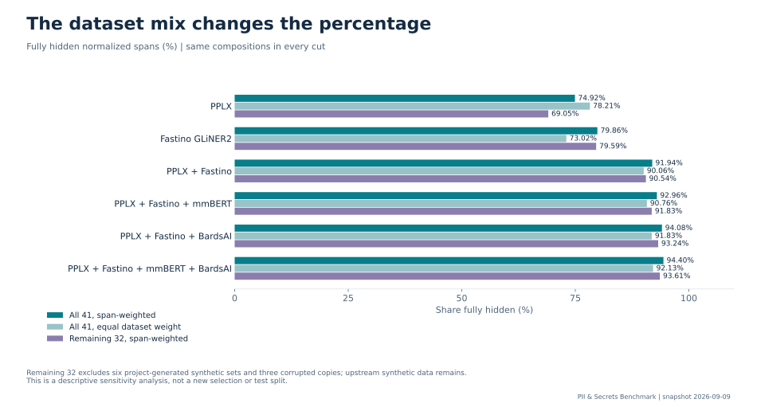

# Dataset effects

Every frozen dataset remains in the headline. A low result can reflect content, annotation policy, conversion, or detector errors; aggregate scores alone do not identify which.

## Four-member composition on every dataset

| Dataset | Language/task | Gold | Fully hidden | Raw original hiding | Character P / R / F1 | Rows retaining residuals | Unannotated rows touched |
|---|---|---:|---:|---:|---|---:|---:|
| [alexen2](types/alexen2.md) | ru / pii | 1,261 | 807 (64.00%) | 807/1,261 (64.00%) | 0.862 / 0.977 / 0.916 | 327/871 | 25/40 |
| [alrosait](types/alrosait.md) | ru / pii | 1,862 | 1,829 (98.23%) | 1,829/1,862 (98.23%) | 0.759 / 0.998 / 0.862 | 32/1,160 | 309/340 |
| [corrupt-hivetrace](types/corrupt-hivetrace.md) | ru / pii | 1,667 | 1,639 (98.32%) | 1,627/1,667 (97.60%) | 0.725 / 0.994 / 0.838 | 28/1,432 | 133/378 |
| [corrupt-redmadrobot](types/corrupt-redmadrobot.md) | ru / pii | 5,531 | 5,068 (91.63%) | 5,106/5,614 (90.95%) | 0.621 / 0.924 / 0.743 | 381/2,470 | 308/371 |
| [factrueval](types/factrueval.md) | ru / pii | 7,966 | 7,811 (98.05%) | 7,903/8,109 (97.46%) | 0.602 / 0.973 / 0.744 | 88/254 | 0/0 |
| [hivetrace](types/hivetrace.md) | ru / pii | 1,667 | 1,649 (98.92%) | 1,644/1,667 (98.62%) | 0.806 / 0.995 / 0.890 | 18/1,432 | 87/378 |
| [jayguard](types/jayguard.md) | ru / pii | 1,195 | 981 (82.09%) | 1,601/1,853 (86.40%) | 0.287 / 0.947 / 0.441 | 123/680 | 158/170 |
| [multiconer-ru](types/multiconer-ru.md) | ru / pii | 1,208 | 942 (77.98%) | 937/1,216 (77.06%) | 0.472 / 0.872 / 0.613 | 263/1,080 | 327/420 |
| [nerel](types/nerel.md) | ru / pii | 24,369 | 22,833 (93.70%) | 23,816/25,702 (92.66%) | 0.654 / 0.937 / 0.770 | 633/933 | 0/0 |
| [nym-ru](types/nym-ru.md) | ru / pii | 9,497 | 9,253 (97.43%) | 9,228/9,499 (97.15%) | 0.851 / 0.994 / 0.917 | 223/1,500 | 0/0 |
| [redact-ru](types/redact-ru.md) | ru / pii | 9,230 | 8,745 (94.75%) | 8,776/9,284 (94.53%) | 0.502 / 0.916 / 0.649 | 231/499 | 1/1 |
| [redmadrobot](types/redmadrobot.md) | ru / pii | 5,516 | 5,180 (93.91%) | 5,252/5,614 (93.55%) | 0.676 / 0.949 / 0.790 | 289/2,470 | 299/371 |
| [rubai-ru](types/rubai-ru.md) | ru / pii | 3,458 | 907 (26.23%) | 907/3,458 (26.23%) | 0.873 / 0.967 / 0.918 | 1,420/1,500 | 0/0 |
| [russian-pii-66k](types/russian-pii-66k.md) | ru / pii | 4,805 | 4,770 (99.27%) | 4,768/4,805 (99.23%) | 0.901 / 0.998 / 0.947 | 35/1,500 | 0/0 |
| [scanpatch](types/scanpatch.md) | ru / pii | 8,708 | 8,367 (96.08%) | 8,412/8,816 (95.42%) | 0.829 / 0.969 / 0.893 | 241/1,329 | 82/171 |
| [synth-jira-comments](types/synth-jira-comments.md) | ru / pii | 2,705 | 2,698 (99.74%) | 2,698/2,705 (99.74%) | 0.666 / 0.999 / 0.799 | 7/300 | 0/0 |
| [synth-ru-tickets](types/synth-ru-tickets.md) | ru / pii | 32,099 | 31,426 (97.90%) | 31,411/32,099 (97.86%) | 0.661 / 0.994 / 0.794 | 271/400 | 0/0 |
| [synth-wiki-tables](types/synth-wiki-tables.md) | ru / pii | 13,094 | 12,513 (95.56%) | 12,500/13,094 (95.46%) | 0.850 / 0.977 / 0.909 | 242/300 | 0/0 |
| [synth-secrets-ru](types/synth-secrets-ru.md) | ru / secrets | 581 | 571 (98.28%) | 568/581 (97.76%) | 0.175 / 0.986 / 0.297 | 10/300 | 300/300 |
| [ameau01](types/ameau01.md) | en / pii | 2,242 | 2,206 (98.39%) | 2,196/2,242 (97.95%) | 0.459 / 0.987 / 0.627 | 32/750 | 455/702 |
| [dialogpii-en](types/dialogpii-en.md) | en / pii | 3,087 | 2,789 (90.35%) | 2,787/3,089 (90.22%) | 0.414 / 0.944 / 0.576 | 100/146 | 1/1 |
| [kiji-en](types/kiji-en.md) | en / pii | 7,623 | 7,609 (99.82%) | 7,666/7,681 (99.80%) | 0.722 / 0.998 / 0.838 | 14/1,000 | 0/0 |
| [nemotron-pii](types/nemotron-pii.md) | en / pii | 9,391 | 9,253 (98.53%) | 9,242/9,393 (98.39%) | 0.738 / 0.976 / 0.840 | 129/1,486 | 5/5 |
| [nym-en](types/nym-en.md) | en / pii | 3,584 | 3,542 (98.83%) | 3,549/3,590 (98.86%) | 0.792 / 0.995 / 0.882 | 42/585 | 71/149 |
| [privy](types/privy.md) | en / pii | 1,899 | 1,870 (98.47%) | 1,871/1,908 (98.06%) | 0.247 / 0.996 / 0.396 | 28/970 | 485/530 |
| [tab-echr](types/tab-echr.md) | en / pii | 3,830 | 3,376 (88.15%) | 3,378/3,834 (88.11%) | 0.368 / 0.967 / 0.533 | 116/127 | 0/0 |
| [tonicai](types/tonicai.md) | en / pii | 2,417 | 2,280 (94.33%) | 2,286/2,426 (94.23%) | 0.719 / 0.980 / 0.829 | 121/1,060 | 193/440 |
| [arthur-passwords](types/arthur-passwords.md) | en / secrets | 280 | 280 (100.00%) | 280/280 (100.00%) | 0.151 / 1.000 / 0.262 | 0/280 | 236/236 |
| [corrupt-secrets-issues](types/corrupt-secrets-issues.md) | en / secrets | 288 | 230 (79.86%) | 226/288 (78.47%) | 0.116 / 0.964 / 0.207 | 55/250 | 250/250 |
| [creddata](types/creddata.md) | en / secrets | 776 | 743 (95.75%) | 740/777 (95.24%) | 0.569 / 0.963 / 0.715 | 33/750 | 628/727 |
| [leak-museum](types/leak-museum.md) | en / secrets | 101 | 96 (95.05%) | 96/101 (95.05%) | 0.241 / 0.908 / 0.380 | 5/52 | 43/45 |
| [leaky-repo](types/leaky-repo.md) | en / secrets | 95 | 88 (92.63%) | 88/95 (92.63%) | 0.502 / 0.987 / 0.666 | 7/43 | 15/16 |
| [secrets-issues](types/secrets-issues.md) | en / secrets | 288 | 229 (79.51%) | 226/288 (78.47%) | 0.115 / 0.966 / 0.206 | 56/250 | 250/250 |
| [secrets-rules](types/secrets-rules.md) | en / secrets | 746 | 740 (99.20%) | 738/746 (98.93%) | 0.448 / 1.000 / 0.619 | 6/746 | 716/750 |
| [synth-env-configs](types/synth-env-configs.md) | en / secrets | 392 | 387 (98.72%) | 386/392 (98.47%) | 0.201 / 0.998 / 0.335 | 5/200 | 200/200 |
| [synth-secrets-en](types/synth-secrets-en.md) | en / secrets | 581 | 569 (97.93%) | 567/581 (97.59%) | 0.176 / 0.987 / 0.298 | 12/300 | 300/300 |
| [dialogpii-multi](types/dialogpii-multi.md) | multi / pii | 10,345 | 8,971 (86.72%) | 8,892/10,372 (85.73%) | 0.373 / 0.873 / 0.523 | 392/500 | 0/0 |
| [gretel-multi](types/gretel-multi.md) | multi / pii | 4,484 | 3,956 (88.22%) | 3,985/4,544 (87.70%) | 0.479 / 0.933 / 0.633 | 193/679 | 17/18 |
| [kiji-multi](types/kiji-multi.md) | multi / pii | 7,565 | 7,533 (99.58%) | 7,644/7,677 (99.57%) | 0.681 / 0.997 / 0.809 | 30/1,000 | 0/0 |
| [nym-multi](types/nym-multi.md) | multi / pii | 8,169 | 8,111 (99.29%) | 8,134/8,209 (99.09%) | 0.777 / 0.997 / 0.873 | 56/1,493 | 5/7 |
| [redact-multi](types/redact-multi.md) | multi / pii | 22,864 | 21,891 (95.74%) | 22,013/23,027 (95.60%) | 0.464 / 0.929 / 0.619 | 455/1,000 | 0/0 |

A zero denominator means that outcome cannot be measured on this dataset. Character P/R/F1 use the normalized mask over all rows. Unannotated rows are not guaranteed to be free of sensitive data.

## Influence of each dataset

This counterfactual removes one dataset at a time from the same fixed composition. A positive change means the remaining average would increase. No dataset is actually removed from the headline, and the change is not an estimate of data quality.

| Dataset | Gold weight | Residual spans | Share of residuals | Hidden % without this dataset | Change, percentage points |
|---|---:|---:|---:|---:|---:|
| rubai-ru | 1.52% | 2,551 | 20.04% | 95.46% | +1.05 |
| nerel | 10.71% | 1,536 | 12.07% | 94.49% | +0.08 |
| dialogpii-multi | 4.55% | 1,374 | 10.80% | 94.77% | +0.37 |
| redact-multi | 10.05% | 973 | 7.64% | 94.25% | -0.15 |
| synth-ru-tickets | 14.11% | 673 | 5.29% | 93.83% | -0.57 |
| synth-wiki-tables | 5.76% | 581 | 4.56% | 94.33% | -0.07 |
| gretel-multi | 1.97% | 528 | 4.15% | 94.53% | +0.12 |
| redact-ru | 4.06% | 485 | 3.81% | 94.39% | -0.01 |
| corrupt-redmadrobot | 2.43% | 463 | 3.64% | 94.47% | +0.07 |
| alexen2 | 0.55% | 454 | 3.57% | 94.57% | +0.17 |
| tab-echr | 1.68% | 454 | 3.57% | 94.51% | +0.11 |
| scanpatch | 3.83% | 341 | 2.68% | 94.34% | -0.07 |
| redmadrobot | 2.42% | 336 | 2.64% | 94.42% | +0.01 |
| dialogpii-en | 1.36% | 298 | 2.34% | 94.46% | +0.06 |
| multiconer-ru | 0.53% | 266 | 2.09% | 94.49% | +0.09 |
| nym-ru | 4.18% | 244 | 1.92% | 94.27% | -0.13 |
| jayguard | 0.53% | 214 | 1.68% | 94.47% | +0.07 |
| factrueval | 3.50% | 155 | 1.22% | 94.27% | -0.13 |
| nemotron-pii | 4.13% | 138 | 1.08% | 94.23% | -0.18 |
| tonicai | 1.06% | 137 | 1.08% | 94.41% | +0.00 |
| secrets-issues | 0.13% | 59 | 0.46% | 94.42% | +0.02 |
| corrupt-secrets-issues | 0.13% | 58 | 0.46% | 94.42% | +0.02 |
| nym-multi | 3.59% | 58 | 0.46% | 94.22% | -0.18 |
| nym-en | 1.58% | 42 | 0.33% | 94.33% | -0.07 |
| ameau01 | 0.99% | 36 | 0.28% | 94.36% | -0.04 |
| russian-pii-66k | 2.11% | 35 | 0.27% | 94.30% | -0.11 |
| alrosait | 0.82% | 33 | 0.26% | 94.37% | -0.03 |
| creddata | 0.34% | 33 | 0.26% | 94.40% | -0.00 |
| kiji-multi | 3.33% | 32 | 0.25% | 94.23% | -0.18 |
| privy | 0.83% | 29 | 0.23% | 94.37% | -0.03 |
| corrupt-hivetrace | 0.73% | 28 | 0.22% | 94.38% | -0.03 |
| hivetrace | 0.73% | 18 | 0.14% | 94.37% | -0.03 |
| kiji-en | 3.35% | 14 | 0.11% | 94.22% | -0.19 |
| synth-secrets-en | 0.26% | 12 | 0.09% | 94.40% | -0.01 |
| synth-secrets-ru | 0.26% | 10 | 0.08% | 94.39% | -0.01 |
| leaky-repo | 0.04% | 7 | 0.05% | 94.41% | +0.00 |
| synth-jira-comments | 1.19% | 7 | 0.05% | 94.34% | -0.06 |
| secrets-rules | 0.33% | 6 | 0.05% | 94.39% | -0.02 |
| leak-museum | 0.04% | 5 | 0.04% | 94.40% | -0.00 |
| synth-env-configs | 0.17% | 5 | 0.04% | 94.40% | -0.01 |
| arthur-passwords | 0.12% | 0 | 0.00% | 94.40% | -0.01 |

The [overview](overview.md) includes the predeclared sensitivity subset and missed-span counts. The remaining 32 cuts still contain upstream synthetic material. [Source conversion notes](../docs/sources.md) explain dropped labels, reconstructed text, language heuristics, nested annotations and incomplete labeling.

## Exact results for every configuration

Per-dataset category pages below contain all measured model configurations and recomputed compositions, with training-source overlaps marked. Original-label counts are in [entity-metrics.csv](entity-metrics.csv). Dataset totals and masking tradeoffs are in [dataset-metrics.csv](dataset-metrics.csv).

- [alexen2](types/alexen2.md): [historical report and bootstrap intervals](datasets/alexen2.md).
- [alrosait](types/alrosait.md): [historical report and bootstrap intervals](datasets/alrosait.md).
- [corrupt-hivetrace](types/corrupt-hivetrace.md): [historical report and bootstrap intervals](datasets/corrupt-hivetrace.md).
- [corrupt-redmadrobot](types/corrupt-redmadrobot.md): [historical report and bootstrap intervals](datasets/corrupt-redmadrobot.md).
- [factrueval](types/factrueval.md): [historical report and bootstrap intervals](datasets/factrueval.md).
- [hivetrace](types/hivetrace.md): [historical report and bootstrap intervals](datasets/hivetrace.md).
- [jayguard](types/jayguard.md): [historical report and bootstrap intervals](datasets/jayguard.md).
- [multiconer-ru](types/multiconer-ru.md): [historical report and bootstrap intervals](datasets/multiconer-ru.md).
- [nerel](types/nerel.md): [historical report and bootstrap intervals](datasets/nerel.md).
- [nym-ru](types/nym-ru.md): [historical report and bootstrap intervals](datasets/nym-ru.md).
- [redact-ru](types/redact-ru.md): [historical report and bootstrap intervals](datasets/redact-ru.md).
- [redmadrobot](types/redmadrobot.md): [historical report and bootstrap intervals](datasets/redmadrobot.md).
- [rubai-ru](types/rubai-ru.md): [historical report and bootstrap intervals](datasets/rubai-ru.md).
- [russian-pii-66k](types/russian-pii-66k.md): [historical report and bootstrap intervals](datasets/russian-pii-66k.md).
- [scanpatch](types/scanpatch.md): [historical report and bootstrap intervals](datasets/scanpatch.md).
- [synth-jira-comments](types/synth-jira-comments.md): [historical report and bootstrap intervals](datasets/synth-jira-comments.md).
- [synth-ru-tickets](types/synth-ru-tickets.md): [historical report and bootstrap intervals](datasets/synth-ru-tickets.md).
- [synth-wiki-tables](types/synth-wiki-tables.md): [historical report and bootstrap intervals](datasets/synth-wiki-tables.md).
- [synth-secrets-ru](types/synth-secrets-ru.md): [historical report and bootstrap intervals](datasets/synth-secrets-ru.md).
- [ameau01](types/ameau01.md): [historical report and bootstrap intervals](datasets/ameau01.md).
- [dialogpii-en](types/dialogpii-en.md): [historical report and bootstrap intervals](datasets/dialogpii-en.md).
- [kiji-en](types/kiji-en.md): [historical report and bootstrap intervals](datasets/kiji-en.md).
- [nemotron-pii](types/nemotron-pii.md): [historical report and bootstrap intervals](datasets/nemotron-pii.md).
- [nym-en](types/nym-en.md): [historical report and bootstrap intervals](datasets/nym-en.md).
- [privy](types/privy.md): [historical report and bootstrap intervals](datasets/privy.md).
- [tab-echr](types/tab-echr.md): [historical report and bootstrap intervals](datasets/tab-echr.md).
- [tonicai](types/tonicai.md): [historical report and bootstrap intervals](datasets/tonicai.md).
- [arthur-passwords](types/arthur-passwords.md): [historical report and bootstrap intervals](datasets/arthur-passwords.md).
- [corrupt-secrets-issues](types/corrupt-secrets-issues.md): [historical report and bootstrap intervals](datasets/corrupt-secrets-issues.md).
- [creddata](types/creddata.md): [historical report and bootstrap intervals](datasets/creddata.md).
- [leak-museum](types/leak-museum.md): [historical report and bootstrap intervals](datasets/leak-museum.md).
- [leaky-repo](types/leaky-repo.md): [historical report and bootstrap intervals](datasets/leaky-repo.md).
- [secrets-issues](types/secrets-issues.md): [historical report and bootstrap intervals](datasets/secrets-issues.md).
- [secrets-rules](types/secrets-rules.md): [historical report and bootstrap intervals](datasets/secrets-rules.md).
- [synth-env-configs](types/synth-env-configs.md): [historical report and bootstrap intervals](datasets/synth-env-configs.md).
- [synth-secrets-en](types/synth-secrets-en.md): [historical report and bootstrap intervals](datasets/synth-secrets-en.md).
- [dialogpii-multi](types/dialogpii-multi.md): [historical report and bootstrap intervals](datasets/dialogpii-multi.md).
- [gretel-multi](types/gretel-multi.md): [historical report and bootstrap intervals](datasets/gretel-multi.md).
- [kiji-multi](types/kiji-multi.md): [historical report and bootstrap intervals](datasets/kiji-multi.md).
- [nym-multi](types/nym-multi.md): [historical report and bootstrap intervals](datasets/nym-multi.md).
- [redact-multi](types/redact-multi.md): [historical report and bootstrap intervals](datasets/redact-multi.md).
